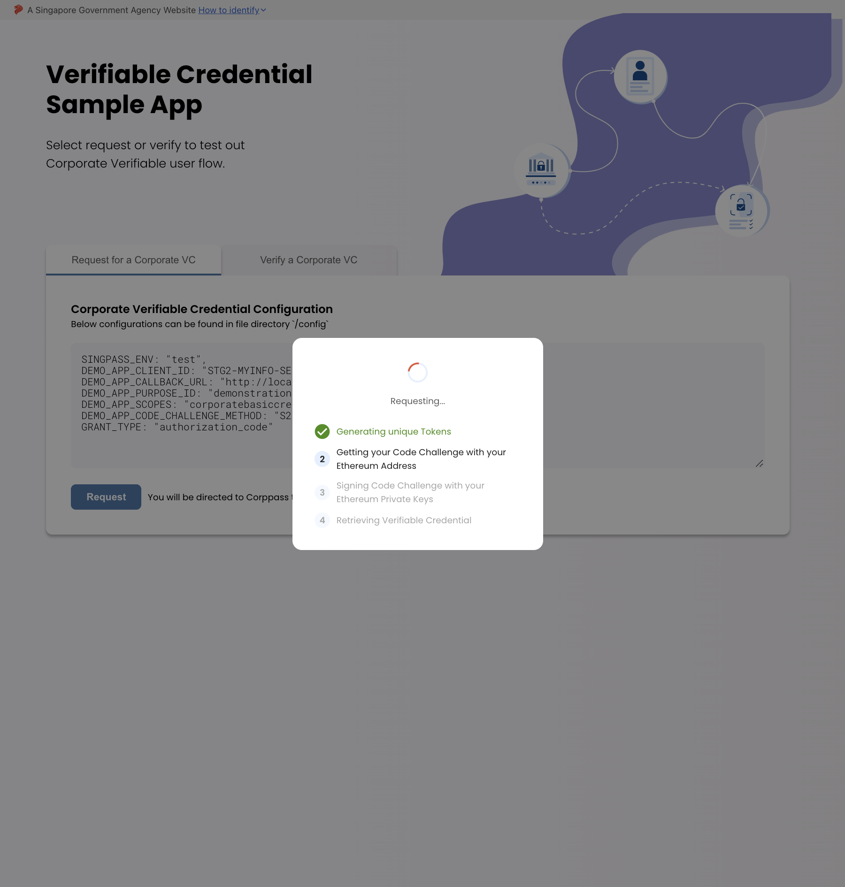
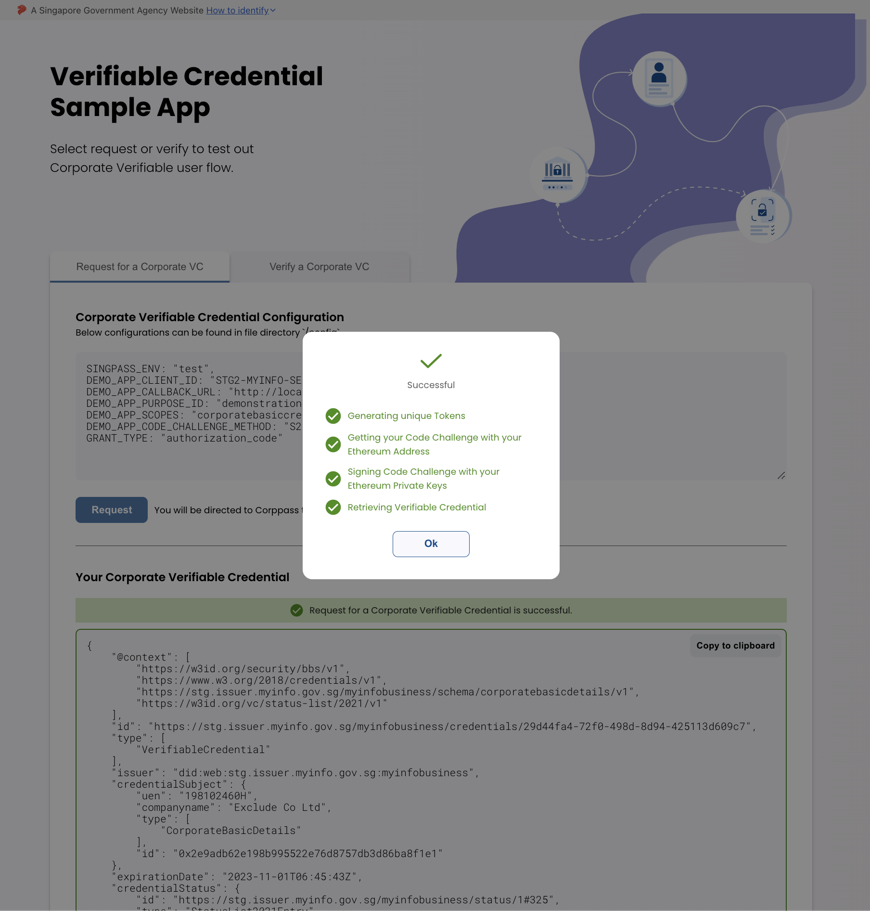
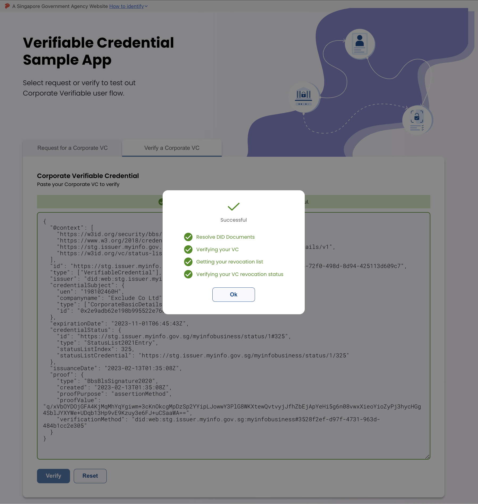

<div id="top"></div>
<div align="center">
  <h1 align="center">MyInfo Corporate VC Demo App</h1>
  <p align="center">
    This app serves as a Proof-of-Concept for the issuance and verification of Corporate Verifiable Credentials through the use of the MyInfoConnector & MyInfoVcVerifier packages.<br />
    <em>Disclaimer: This application is <strong>not</strong> production ready and should only be used as a reference and a proof-of-concept.</em>
    <div>
      <!-- SHIELD BADGES -->
      <!-- package dependency -->
      <a href="./blob/main/package.json">
        
      </a>
    </div>
    <br />
    <a href="./docs"><strong>Explore the docs »</strong></a>
    <br />
    <br />
    <a href="./issues/new?assignees=&labels=&template=bug_report.md&title=">Report Bug</a>
    ·
    <a href="./issues/new?assignees=&labels=&template=feature_request.md&title=">Request Feature</a>
  </p>
</div>

<!-- TABLE OF CONTENTS -->
<details open>
  <summary>Table of Contents</summary>
  <ol>
    <li>
      <a href="#about-the-project">About The Project</a>
    </li>
    <li>
      <a href="#local-development">Local Development</a>
      <ul>
        <li><a href="#prerequisites">Prerequisites</a></li>
        <li><a href="#initial-setup">Initial Setup</a></li>
      </ul>
    </li>
    <li><a href="#testing">Testing</a></li>
    <li><a href="#deployment">Deployment</a></li>
      <ul>
        <li><a href="#mimicking-production-on-local">Mimicking production on local</a></li>
        <li><a href="#deploying-on-external-servers">Deploying on external servers</a></li>
      </ul>
    <li><a href="#more-screenshots">More Screenshots</a></li>
  </ol>
</details>

<!-- ABOUT THE PROJECT -->

## About The Project

<div align="center">
  <h3>Product Screenshot</h3>
  
</div>

<p align="right">(<a href="#top">back to top</a>)</p>

## Local Development

Refer to the [`development`](./docs/development.md) documentation for more details.

### Prerequisites

- [node](https://nodejs.org/en/) >= v18.x
- npm >= v8.x

### Initial Setup

1. Clone the project

```bash
git clone git@github.com:singpass/myinfobiz-demo-app-vc.git
```

2. Make a copy of [`./.env.local.example`](.env.local.example) and rename it to `.env.local`.
3. Replace the values found in `.env.local` as required. Refer to [configurations docs](docs/configurations.md) for more information on the specific configuration that is needed.

4. Replace the sample encryption and signing keys found at [`./cert`](./cert/)

5. Install dependencies

```bash
# clean install
npm ci
```

6. Start development server on your local

```bash
# reloads UI on code change
npm run dev
```

<p align="right">(<a href="#top">back to top</a>)</p>

## Testing

This is a [Next.js](https://nextjs.org/) project bootstrapped with [`create-next-app`](https://github.com/vercel/next.js/tree/canary/packages/create-next-app). This project leverages [Jest] for unit tests, and [Cypress] for e2e tests.

To run unit tests with [Jest]:

```bash
npm run test:unit
```

To run e2e tests with [Cypress]:

```bash
npm run test:e2e
```

<p align="right">(<a href="#top">back to top</a>)</p>

## Deployment

Refer to the [`deployment`](./docs/deployment.md) documentation for more details.

### Mimicking production on local

1. Build the app

```bash
npm run build
```

2. Serve the app on a mimicked production environment

```bash
npm run start
```

### Deploying on external servers

- [Next.js Deployment Documentation](https://nextjs.org/docs/deployment)
- [Deploying on Netlify](https://www.netlify.com/with/nextjs/)

## More Screenshots

|         |                     Default                      |                       Loading                       |                       Success                       |
| :-----: | :----------------------------------------------: | :-------------------------------------------------: | :-------------------------------------------------: |
| Request |  |  |  |
| Verify  |   |   |   |

[jest]: https://jestjs.io/
[cypress]: https://www.cypress.io/
